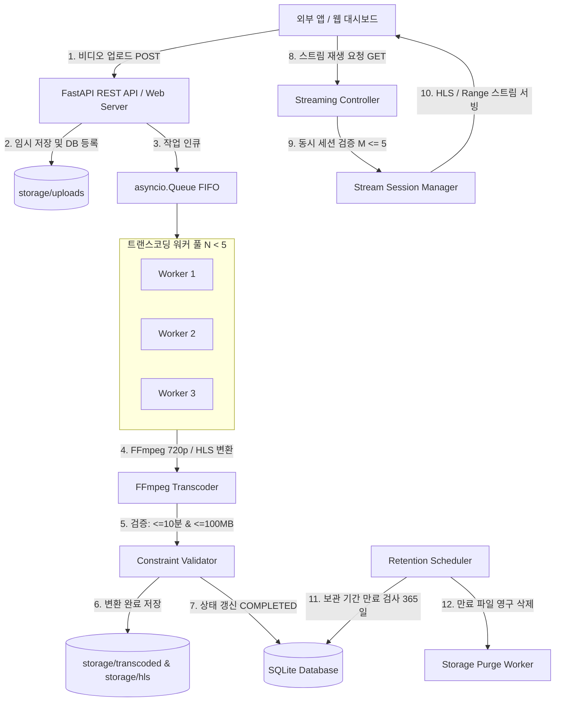

# VDSTREAM 기술 사양서 (SPECIFICATION.md)

- **문서 버전**: v1.0.0
- **작성일**: 2026-10-06 22:42:16
- **위치**: `notes/SPECIFICATION.md`

---

## 1. 시스템 아키텍처 개요 (System Architecture)

VDSTREAM은 대용량 비디오 파일의 비동기 수신, FFmpeg 기반의 최대 720p 트랜스코딩, HLS/Range 스트리밍, 엄격한 동시성 슬롯 제한($N < 5$, $M = 5$), 그리고 1년 보관 수명주기를 관리하는 마이크로서비스입니다.



---

## 2. 패키지 구성도 및 디렉토리 구조 (Package Hierarchy)

```text
vdstream/
├── .env                              # 시스템 환경설정 (FFmpeg, 동시성, 보관기간, 디렉토리 등)
├── GOAL.md                           # 프로젝트 목표 및 구현 요약
├── README.md                         # 종합 프로젝트 안내 및 실행 매뉴얼
├── vdstream-api.md                   # 외부 연동용 REST API 명세서
├── run.py                            # 애플리케이션 엔트리포인트 실행 스크립트
├── requirements.txt                  # 파이썬 의존성 패키지 목록
├── app/                              # 메인 애플리케이션 패키지
│   ├── __init__.py
│   ├── main.py                       # FastAPI 인스턴스 초기화, 라이프사이클 이벤트
│   ├── config.py                     # pydantic_settings 기반 환경변수 로더
│   ├── database.py                   # SQLAlchemy DB 엔진, 세션 팩토리, 테이블 초기화
│   ├── models/                       # 데이터 모델
│   │   ├── __init__.py
│   │   └── video.py                  # Video 메타데이터, 상태, 만료일자 ORM 모델
│   ├── services/                     # 핵심 비즈니스 로직 및 서브시스템
│   │   ├── __init__.py
│   │   ├── ffmpeg_service.py         # FFmpeg/FFprobe 파이프라인 (720p, HLS, 길이/용량 검증)
│   │   ├── queue_manager.py          # 작업 큐(Queue) 및 N개 트랜스코딩 세마포어
│   │   ├── stream_manager.py         # M=5 동시 스트리밍 세션 슬롯 관리자
│   │   └── retention_service.py      # 비디오 보관 기간(365일) 만료 및 가비지 컬렉터
│   ├── api/                          # REST API 엔드포인트 (외부 시스템 연계용)
│   │   ├── __init__.py
│   │   └── v1/
│   │       ├── __init__.py
│   │       ├── videos.py             # 업로드, 상태 조회, 스트림 URL, 목록/삭제 API
│   │       └── streams.py            # HLS 플레이리스트, 세그먼트, Range 재생 엔드포인트
│   ├── dashboard/                    # 웹 관리 대시보드
│   │   ├── __init__.py
│   │   └── routes.py                 # 대시보드 SSR 라우팅
│   ├── templates/                    # Jinja2 HTML 템플릿
│   │   ├── base.html                 # 대시보드 공통 레이아웃
│   │   └── index.html                # 메인 대시보드 (업로드, 상태 모니터, 플레이어, 관리 목록)
│   └── static/                       # 정적 리소스
│       ├── css/style.css             # 모던 다크/라이트 테마 스타일
│       └── js/dashboard.js           # 비동기 업로드, 상태 폴링, HLS.js 플레이어 제어
├── storage/                          # 미디어 저장소
│   ├── uploads/                      # 업로드 원본 비디오 임시 보관
│   ├── transcoded/                   # 720p MP4 결과물 보관
│   └── hls/                          # HLS m3u8 및 ts 세그먼트 보관
├── tests/                            # 자동화 검증 테스트 슈트
│   ├── __init__.py
│   ├── conftest.py                   # 테스트 픽스처
│   ├── test_api.py                   # API 업로드, 상태, 스트림 링크 테스트
│   ├── test_queue.py                 # 동시성 큐 및 N 제한 동작 테스트
│   └── test_stream_limit.py          # 동시 스트리밍 M=5 슬롯 제어 테스트
└── notes/                            # 엔지니어링 히스토리 및 개발 기록
    ├── requirement.md                # 누적 요구사항 정의서
    ├── SPECIFICATION.md              # 본 기술 사양서
    ├── plan_202610062242.md          # MVP 정의 및 상세 개발 계획
    ├── history.md                    # 개발 진행 이력
    ├── req_202610062242.md           # 원본 요구사항 기록
    └── result_202610062242.md        # 산출물 및 테스트 결과 보고서
```

---

## 2.1 URL 라우팅 계층도 (Basepath & Subpath Architecture)

시스템은 환경변수 `DEFAULT_PREFIX` (기본값: `vdstream`)를 루트 접두사(Basepath)로 사용하여 서비스됩니다.

```text
http://<HOST>:<PORT>/
├── /                                           --> 307 Redirect to /{DEFAULT_PREFIX}/dashboard
└── /{DEFAULT_PREFIX}                           --> 307 Redirect to /{DEFAULT_PREFIX}/dashboard
    ├── /dashboard                              --> 웹 관리 대시보드 SSR UI
    ├── /docs                                   --> Swagger 대화형 API 문서
    ├── /openapi.json                           --> OpenAPI 3.0 사양 JSON
    ├── /static/                                --> CSS/JS 정적 에셋 서빙
    │   ├── /css/style.css
    │   └── /js/dashboard.js
    └── /api/v1/                                --> RESTful API v1 서브패스
        ├── /videos                             --> 비디오 관리 및 업로드
        │   ├── POST /upload                    --> 비디오 업로드 및 큐잉
        │   ├── GET  /{video_id}/status         --> 트랜스코딩 상태 조회
        │   ├── GET  /{video_id}/stream         --> 스트리밍 세션 및 URL 발급
        │   ├── GET                             --> 비디오 목록 페이징
        │   └── DELETE /{video_id}              --> 비디오 즉시 삭제
        ├── /streams                            --> HLS / MP4 Range 스트리밍
        │   ├── GET  /{video_id}/master.m3u8    --> HLS 매니페스트 서빙
        │   ├── GET  /{video_id}/mp4            --> HTTP 206 Partial Content Range 스트림
        │   ├── GET  /{video_id}/{segment}      --> HLS TS 세그먼트 전송
        │   ├── POST /{session_id}/heartbeat    --> 시청 세션 15초 하트비트
        │   └── POST /{session_id}/release      --> 세션 즉시 반환
        └── /system                             --> 시스템 리소스 모니터링
            └── GET  /status                    --> N/M 동시성 및 엔진 상태
```

---

## 3. 기능 세부 내역 및 컴포넌트 설계

### 3.1 `ConcurrencyManager` (작업 큐 및 $N < 5$ 제어)
- **동시 처리 수**: `MAX_CONCURRENT_TRANSCODE = 3` (설정값 $N < 5$).
- **대기 큐**: `asyncio.Queue(maxsize=MAX_QUEUE_SIZE)` (기본 최대 20개 대기).
- **작업 인큐 로직**:
  - 클라이언트가 업로드 시, 비디오 메타데이터를 DB에 `QUEUED` 상태로 저장.
  - 대기 큐에 `video_id`를 푸시. 대기 큐가 가득 찼을 경우 즉시 `QueueFullException` 발생 -> HTTP 429 반환.
- **백그라운드 워커**:
  - $N$개의 영구 비동기 워커 코루틴이 큐에서 작업을 꺼내어 트랜스코딩 실행.
  - 작업 시작 시 `PROCESSING`, 완료 시 `COMPLETED`, 오류 시 `FAILED` 상태로 전환.

### 3.2 `FFmpegTranscoder` (영상 변환 및 정책 검증)
- **FFprobe 메타데이터 추출**:
  - `ffprobe -v error -show_entries format=duration,size -show_streams -of json <input>`
  - 지속 시간(Duration) 검사: `duration > 600`초 (10분) 초과 시 즉시 작업 중단 및 에러 기록.
- **720p 트랜스코딩 명령어 파이프라인**:
  ```bash
  ffmpeg -y -i input.mp4 \
    -vf "scale=-2:min(720\,ih)" \
    -c:v libx264 -preset fast -crf 23 -maxrate 2500k -bufsize 5000k \
    -c:a aac -b:a 128k -ar 44100 \
    -movflags +faststart \
    output_720p.mp4
  ```
- **HLS 변환 명령어 파이프라인**:
  ```bash
  ffmpeg -y -i output_720p.mp4 \
    -c copy \
    -hls_time 4 -hls_list_size 0 \
    -hls_segment_filename "hls_dir/segment_%03d.ts" \
    hls_dir/master.m3u8
  ```
- **최종 파일 크기 제약 검증**:
  - 변환된 MP4 파일 크기가 **100MB**를 초과하는지 검사.
  - 초과 시 에러 처리 또는 품질 재압축 fallback.
- **FFmpeg 미설치 환경 대비 Graceful Fallback**:
  - 로컬 환경에 ffmpeg 실행 파일이 없을 경우 시스템이 다운되지 않고 명확한 안내 에러를 응답하거나, 개발/테스트용 바이패스 모드를 제공하여 안정적 구동 보장.

### 3.3 `StreamSessionManager` ($M = 5$ 동시 스트리밍 슬롯 제어)
- **동시 스트리밍 수**: `MAX_CONCURRENT_STREAMS = 5`.
- **세션 발급 메커니즘**:
  - 클라이언트가 스트리밍을 시작하려면 `/api/v1/videos/{video_id}/stream/session`을 호출하여 `session_id`를 발급받아야 함.
  - 활성 세션 수가 이미 5개이고 모든 세션이 살아있다면 HTTP 429 반환.
- **하트비트 및 슬롯 자동 반환**:
  - 클라이언트는 15초 주기로 `/api/v1/streams/{session_id}/heartbeat` 요청을 전송.
  - `STREAM_SESSION_TIMEOUT_SECONDS = 30`초 동안 하트비트가 없으면 슬롯 자동 반환 및 세션 소멸.
  - 클라이언트 재생 종료 시 `/api/v1/streams/{session_id}/release`를 통해 즉시 슬롯 반환.
- **Range / HLS 서빙**:
  - HLS `.m3u8` 및 `.ts` 파일은 세션 토큰 확인 후 즉시 서빙.
  - Range 요청에 대해 `HTTP 206 Partial Content` 헤더(`Accept-Ranges: bytes`, `Content-Range`)를 올바르게 처리.

### 3.4 `RetentionService` (365일 보관 수명주기)
- **보관 기한 계산**:
  - `video.expires_at = video.created_at + timedelta(days=settings.RETENTION_DAYS)`
- **스케줄러 동작**:
  - 백그라운드 태스크가 1시간(또는 설정된 주기)마다 실행되어 `Video.expires_at <= datetime.utcnow()` 레코드 검색.
  - 원본 파일, 트랜스코딩 파일, HLS 디렉토리를 재귀 삭제(`shutil.rmtree`).
  - DB 레코드 삭제 또는 `EXPIRED` 상태 플래그 처리.

---

## 4. 데이터베이스 엔티티 설계 (Database ERD)

```text
Table: videos
- id (String/UUID, PK)                : 고유 비디오 식별자
- original_filename (String)          : 원본 업로드 파일명
- stored_upload_path (String)         : 원본 파일 물리 저장 경로
- transcoded_path (String, Nullable)  : 720p 트랜스코딩 MP4 경로
- hls_dir_path (String, Nullable)     : HLS 세그먼트 디렉토리 경로
- status (Enum)                       : QUEUED, PROCESSING, COMPLETED, FAILED, EXPIRED
- status_message (Text, Nullable)     : 상태 설명 또는 실패 사유
- duration_seconds (Float, Nullable)  : 영상 재생 길이 (최대 600초)
- file_size_bytes (BigInteger)        : 트랜스코딩 결과 파일 크기 (최대 100MB)
- width (Integer, Nullable)           : 가로 해상도
- height (Integer, Nullable)          : 세로 해상도 (최대 720)
- view_count (Integer, Default 0)     : 누적 재생 횟수
- created_at (DateTime)               : 생성 일시
- updated_at (DateTime)               : 수정 일시
- expires_at (DateTime)               : 보관 만료 일시 (기본 created_at + 365일)
```

---

## 5. 개발 검토 시 필요한 제약사항 (Constraints & Considerations)

1. **호스트 OS FFmpeg 바이너리 의존성**:
   - 윈도우 환경(`PATH` 또는 `./bin/ffmpeg.exe`, `./bin/ffprobe.exe`)에 바이너리가 위치해야 정상 트랜스코딩이 수행됨.
   - 바이너리가 부재할 경우 서비스 구동 자체가 실패하지 않도록 바이너리 유효성 진단 및 친절한 에러 핸들링, 테스트 시 가상 인코더(Dummy Transcoder) 전환 메커니즘을 구축해야 함.
2. **동시성 큐의 프로세스 내 메모리 관리**:
   - 현재 단일 노드 기반 `asyncio.Queue`로 구현되므로, 서버 재시작 시 메모리 큐의 대기 작업이 손실되지 않도록 서버 기동 시 DB의 `QUEUED` / `PROCESSING` 상태 비디오를 복구하는 Recovery 로직이 필요함.
3. **100MB 파일 크기 강제 전략**:
   - 10분(600초) 영상의 경우 비트레이트가 2500kbps이면 약 $2500 \times 600 / 8 \approx 187.5\text{MB}$가 되어 100MB를 초과할 수 있음.
   - 따라서 영상 길이에 맞춰 비트레이트를 동적으로 조정하는 공식:
     $$\text{Target Bitrate} = \min\left(2500, \left(\frac{95\text{MB} \times 8 \times 1024}{Duration}\right) - 128\right)\text{ kbps}$$
     을 적용하여 영상이 10분에 육박해도 결과물이 100MB를 절대 초과하지 않도록 보장함.
4. **M=5 동시 스트리밍 브라우저 연결 특성**:
   - 브라우저가 HLS 청크를 수신할 때 연결을 맺고 끊기를 반복할 수 있으므로, 단순 HTTP 연결 수 대신 **하트비트 기반 세션 토큰** 방식을 적용하여 정확하게 5명의 동시 시청자를 통제함.

---

## 6. 추가 개발 제안 내용 (Future Recommendations)

1. **분산 인프라 지원 (Redis & Celery / RQ)**:
   - 트래픽 확장에 대비하여 현재 인메모리 큐를 Redis 기반 분산 큐로 교체하고 분산 워커(Worker Node)를 증설할 수 있는 인터페이스 분리.
2. **클라우드 오브젝트 스토리지 연동 (AWS S3 / Cloudflare R2)**:
   - 로컬 디스크 용량 한계를 극복하기 위해 트랜스코딩 완료 후 S3 호환 버킷으로 자동 업로드하고 CDN(CloudFront 등)을 통한 엣지 캐싱 스트리밍 지원.
3. **멀티 비트레이트 적응형 HLS (ABR - Adaptive Bitrate)**:
   - 720p 단일 해상도 외에 480p, 360p 변형 스트림을 함께 생성하여 네트워크 상태에 따라 최적 화질로 자동 전환되는 멀티 렌디션 HLS 지원.
4. **웹훅(Webhook) 통지 시스템**:
   - 트랜스코딩 완료 시 외부 애플리케이션으로 완료 콜백 이벤트를 HTTP POST로 푸시하여 폴링 부하를 줄이는 웹훅 기능 도입.
