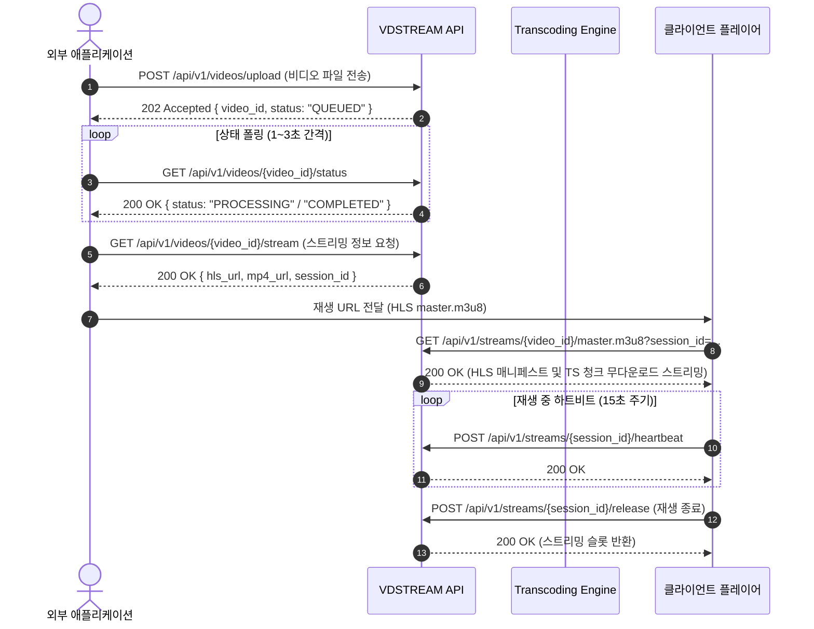

# VDSTREAM API 명세서 (vdstream-api.md)

이 문서는 외부 애플리케이션 및 서비스에서 **VDSTREAM** 플랫폼과 연동하여 비디오를 원격 업로드하고, 720p 트랜스코딩 진행 상태를 모니터링하며, HLS/Range 기반 즉시 스트리밍 재생 URL을 획득할 수 있도록 정의된 표준 RESTful API 명세서입니다.

---

## 1. 기본 정보 (Overview)

- **Base URL**: `http://<SERVER_HOST>:<PORT>/{DEFAULT_PREFIX}/api/v1` (기본값: `http://localhost:5000/vdstream/api/v1`)
  - 환경변수 `DEFAULT_PREFIX` (기본값: `vdstream`)에 따라 Basepath가 동적으로 결정됩니다.
- **Web Dashboard**: `http://<SERVER_HOST>:<PORT>/{DEFAULT_PREFIX}/dashboard`
- **Swagger API Docs**: `http://<SERVER_HOST>:<PORT>/{DEFAULT_PREFIX}/docs`
- **API Version**: `v1`
- **데이터 포맷**: JSON (`application/json`), 파일 전송 시 `multipart/form-data`
- **인증 방식 (선택/권장)**:
  - Header: `X-App-Pin: <APP_PIN>` 또는 Query Parameter `?pin=<APP_PIN>` (기본 `.env` 설정값: `1234`)
- **주요 제약 정책**:
  - 최대 동시 트랜스코딩 작업 수: **$N < 5$개 (기본 3개)**, 초과 시 내부 큐 대기 (최대 20개). 큐 가득 찰 시 `429 Too Many Requests`.
  - 최대 동시 스트리밍 시청 수: **$M = 5$개**, 5개 초과 시 `429 Too Many Streams`.
  - 트랜스코딩 영상 제한: **최대 100MB**, 영상 길이 **최대 10분(600초)**. 초과 시 트랜스코딩 `FAILED`.
  - 기본 보관 기간: **365일 (1년)** 후 자동 만료 및 삭제.

---

## 2. 연동 흐름 시퀀스 (Integration Workflow)



---

## 3. 엔드포인트 세부 명세 (Endpoints)

### 3.1 비디오 업로드 (Upload Video)
비디오 파일을 시스템에 업로드하고 트랜스코딩 큐에 작업을 등록합니다.

- **HTTP Method**: `POST`
- **Path**: `/api/v1/videos/upload`
- **Content-Type**: `multipart/form-data`
- **요청 헤더**:
  - `X-App-Pin`: `1234` (설정된 경우)
- **요청 파라미터 (Form Data)**:
  - `file` (File, 필수): 업로드할 비디오 파일 (`.mp4`, `.mov`, `.mkv`, `.avi`, `.webm` 등)
  - `title` (String, 선택): 비디오 제목 (미입력 시 원본 파일명 사용)

#### 응답 예시 (202 Accepted)
```json
{
  "status": "success",
  "message": "Video uploaded and queued for transcoding",
  "data": {
    "video_id": "vid_20261006_a9b8c7d6",
    "filename": "sample_presentation.mp4",
    "status": "QUEUED",
    "queue_position": 1,
    "created_at": "2026-10-06T22:42:16Z",
    "expires_at": "2027-10-06T22:42:16Z",
    "status_url": "/api/v1/videos/vid_20261006_a9b8c7d6/status"
  }
}
```

#### 에러 응답
- `400 Bad Request`: 지원하지 않는 파일 포맷이거나 파일이 전송되지 않은 경우.
- `429 Too Many Requests`: 트랜스코딩 대기 큐(최대 20개)가 가득 차서 더 이상 요청을 수용할 수 없는 경우.

---

### 3.2 트랜스코딩 및 업로드 상태 조회 (Get Video Status)
등록된 비디오의 현재 트랜스코딩 진행 상태를 확인합니다.

- **HTTP Method**: `GET`
- **Path**: `/api/v1/videos/{video_id}/status`
- **요청 파라미터**:
  - `video_id` (Path, 필수): 비디오 식별자

#### 응답 예시 (200 OK - 작업 완료)
```json
{
  "status": "success",
  "data": {
    "video_id": "vid_20261006_a9b8c7d6",
    "title": "sample_presentation.mp4",
    "status": "PROCESSING",
    "status_message": "Transcoding 720p H.264 (45%)...",
    "progress_percent": 45.0,
    "duration_seconds": 320.5,
    "duration_formatted": "5:20",
    "width": 1280,
    "height": 720,
    "file_size_bytes": 48234400,
    "file_size_mb": 46.0,
    "created_at": "2026-10-06T22:42:16Z",
    "expires_at": "2027-10-06T22:42:16Z",
    "is_ready": false
  }
}
```

완료 상태(COMPLETED) 시 응답 예시:
```json
{
  "status": "success",
  "data": {
    "video_id": "vid_20261006_a9b8c7d6",
    "title": "sample_presentation.mp4",
    "status": "COMPLETED",
    "status_message": "Transcoding completed successfully. Ready for instant streaming.",
    "progress_percent": 100.0,
    "duration_seconds": 320.5,
    "duration_formatted": "5:20",
    "width": 1280,
    "height": 720,
    "file_size_bytes": 48234400,
    "file_size_mb": 46.0,
    "created_at": "2026-10-06T22:42:16Z",
    "expires_at": "2027-10-06T22:42:16Z",
    "is_ready": true,
    "stream_info_url": "/api/v1/videos/vid_20261006_a9b8c7d6/stream"
  }
}
```

#### 상태 코드 정의 (`status` 필드 및 `progress_percent`)
- `QUEUED`: 대기열에서 트랜스코딩 차례 대기 중 (`progress_percent: 0.0`)
- `PROCESSING`: 720p 트랜스코딩 및 HLS 번들링 작업 진행 중 (`progress_percent`: 실시간 `1.0 ~ 99.0%`)
- `COMPLETED`: 트랜스코딩 완료. 스트리밍 시청 가능 상태 (`progress_percent: 100.0`, `is_ready: true`)
- `FAILED`: 변환 실패 (예: 10분 초과, 100MB 초과, 손상된 영상 등, `progress_percent: 0.0`)
- `EXPIRED`: 365일 보관 기간이 만료되어 폐기된 영상


---

### 3.3 스트리밍 정보 및 재생 세션 획득 (Get Streaming Info)
비디오 재생에 필요한 스트리밍 URL 및 동시 시청 세션 토큰을 발급받습니다.

- **HTTP Method**: `GET`
- **Path**: `/api/v1/videos/{video_id}/stream`
- **요청 파라미터**:
  - `video_id` (Path, 필수): 비디오 식별자

#### 응답 예시 (200 OK)
```json
{
  "status": "success",
  "data": {
    "video_id": "vid_20261006_a9b8c7d6",
    "session_id": "sess_89f1a23b-4567",
    "session_expires_in_seconds": 60,
    "streaming_urls": {
      "preview_url": "/api/v1/streams/vid_20261006_a9b8c7d6/preview",
      "hls_master_url": "/api/v1/streams/vid_20261006_a9b8c7d6/master.m3u8?session_id=sess_89f1a23b-4567",
      "hls_absolute_url": "http://localhost:5000/api/v1/streams/vid_20261006_a9b8c7d6/master.m3u8?session_id=sess_89f1a23b-4567",
      "mp4_range_url": "/api/v1/streams/vid_20261006_a9b8c7d6/mp4?session_id=sess_89f1a23b-4567"
    },
    "active_streams": 2,
    "max_concurrent_streams": 5
  }
}
```

> **참고**:
> - `preview_url`: 외부 웹 페이지 임베드 및 단순 미리보기 전용 URL입니다. 세션 토큰 만료 없이 직접 720p MP4 재생이 가능합니다.
> - 스트리밍 데이터 요청(MP4 Range 및 HLS 청크 요청)이 발생할 때마다 세션 수명이 자동으로 연장(Auto-Heartbeat)됩니다.

#### 에러 응답
- `400 Bad Request`: 비디오가 아직 `COMPLETED` 상태가 아닌 경우.
- `429 Too Many Requests`: 현재 활성 스트리밍 시청자 수가 $M=5$명에 도달하여 슬롯이 없는 경우.

---

### 3.4 스트리밍 세션 하트비트 유지 (Heartbeat)
재생 중 세션 슬롯을 유지하기 위해 15초 간격으로 하트비트를 전송합니다.

- **HTTP Method**: `POST`
- **Path**: `/api/v1/streams/{session_id}/heartbeat`

#### 응답 예시 (200 OK)
```json
{
  "status": "success",
  "message": "Heartbeat updated",
  "session_id": "sess_89f1a23b-4567",
  "valid_until": "2026-10-06T22:45:10Z"
}
```

---

### 3.5 스트리밍 세션 즉시 해제 (Release Session)
재생 종료 또는 브라우저 창 닫힘 시 스트리밍 슬롯을 즉시 반환합니다.

- **HTTP Method**: `POST`
- **Path**: `/api/v1/streams/{session_id}/release`

#### 응답 예시 (200 OK)
```json
{
  "status": "success",
  "message": "Stream session released successfully"
}
```

---

### 3.6 비디오 목록 조회 (List Videos)
저장 및 관리 중인 비디오 목록을 페이징하여 조회합니다.

- **HTTP Method**: `GET`
- **Path**: `/api/v1/videos`
- **Query Parameters**:
  - `page` (Integer, 기본값 1): 페이지 번호
  - `limit` (Integer, 기본값 20): 페이지당 개수
  - `status` (String, 선택): 상태 필터 (`COMPLETED`, `QUEUED`, `PROCESSING`, `FAILED`)

---

### 3.7 비디오 삭제 (Delete Video)
특정 비디오 및 연관된 트랜스코딩/HLS 파일을 즉시 영구 삭제합니다.

- **HTTP Method**: `DELETE`
- **Path**: `/api/v1/videos/{video_id}`

---

### 3.8 시스템 리소스 현황 조회 (System Status)
트랜스코딩 워커 및 동시 스트리밍 사용 현황을 확인합니다.

- **HTTP Method**: `GET`
- **Path**: `/api/v1/system/status`

#### 응답 예시 (200 OK)
```json
{
  "status": "success",
  "data": {
    "transcoding": {
      "active_workers": 1,
      "max_concurrent": 3,
      "queued_tasks": 0,
      "max_queue_size": 20
    },
    "streaming": {
      "active_sessions": 2,
      "max_concurrent": 5,
      "available_slots": 3
    },
    "retention_policy_days": 365
  }
}
```

### 3.8 컨테이너 헬스체크 (Health Check)
- **Endpoint**: `GET /{DEFAULT_PREFIX}/api/status` (또는 fallback `GET /api/status`)
- **Docker HEALTHCHECK 지원**:
  ```bash
  CMD python -c "import os, requests; prefix = os.getenv('DEFAULT_PREFIX', ''); requests.get(f'http://localhost:5000{prefix}/api/status')"
  ```
- **Response Example**:
```json
{
  "status": "healthy",
  "service": "vdstream",
  "prefix": "/vdstream",
  "queue_active": true,
  "stream_active": true
}
```

---


## 4. 클라이언트 연동 예제 코드

### 4.1 Python `requests` 연동 예제
```python
import time
import requests

API_HOST = "http://localhost:5000"
APP_PIN = "1234"
headers = {"X-App-Pin": APP_PIN}

# 1. 파일 업로드
with open("my_test_video.mp4", "rb") as f:
    resp = requests.post(
        f"{API_HOST}/api/v1/videos/upload",
        files={"file": ("my_test_video.mp4", f, "video/mp4")},
        headers=headers,
    )
data = resp.json()["data"]
video_id = data["video_id"]
print(f"Uploaded! Video ID: {video_id}")

# 2. 트랜스코딩 완료 대기 (폴링)
while True:
    status_resp = requests.get(f"{API_HOST}/api/v1/videos/{video_id}/status")
    status_data = status_resp.json()["data"]
    status = status_data["status"]
    print(f"Transcoding status: {status}")
    if status == "COMPLETED":
        break
    elif status == "FAILED":
        raise RuntimeError("Transcoding failed!")
    time.sleep(2)

# 3. 스트리밍 URL 및 세션 발급
stream_resp = requests.get(f"{API_HOST}/api/v1/videos/{video_id}/stream")
stream_info = stream_resp.json()["data"]
hls_url = stream_info["streaming_urls"]["hls_absolute_url"]
session_id = stream_info["session_id"]
print(f"HLS Stream URL for Player: {hls_url}")
```

### 4.2 cURL CLI 연동 예제
```bash
# 1. 업로드
curl -X POST "http://localhost:5000/api/v1/videos/upload" \
  -H "X-App-Pin: 1234" \
  -F "file=@presentation.mp4"

# 2. 상태 조회
curl -X GET "http://localhost:5000/api/v1/videos/vid_20261006_a9b8c7d6/status"

# 3. 스트리밍 URL 조회
curl -X GET "http://localhost:5000/api/v1/videos/vid_20261006_a9b8c7d6/stream"
```
